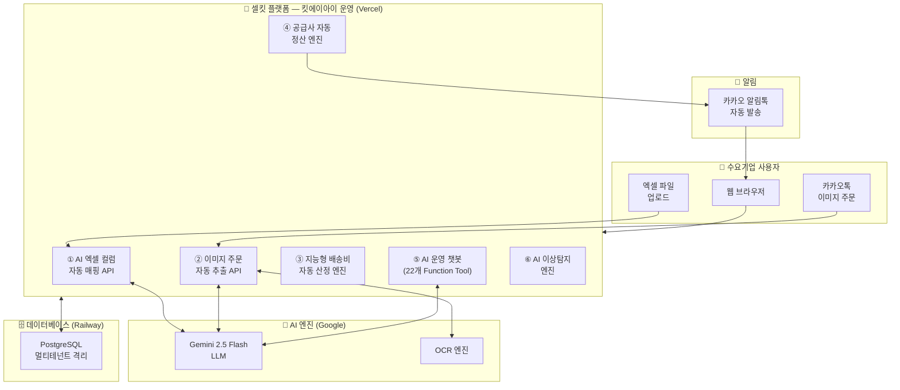

# 셀킷(SellKitt) 시스템 구성도

## ■ Mermaid 다이어그램 (mermaid.live 에서 이미지 변환 가능)



---

## ■ 텍스트 구성도 (HWP 직접 입력용)

```
┌─────────────────────────────────────────────────────────────┐
│                     수요기업 사용자                           │
│  [웹 브라우저]    [카카오톡 이미지]    [엑셀 파일 업로드]     │
└──────────┬───────────────┬──────────────────┬───────────────┘
           │               │                  │
           ▼               ▼                  ▼
┌─────────────────────────────────────────────────────────────┐
│           셀킷(SellKitt) 플랫폼  —  킷에이아이 운영           │
│                      (Vercel 클라우드)                        │
│                                                               │
│  ┌─────────────┐  ┌─────────────┐  ┌─────────────────────┐  │
│  │① AI 엑셀    │  │② 이미지 주문│  │③ 지능형 배송비      │  │
│  │  컬럼 자동  │  │  자동 추출  │  │  자동 산정 엔진     │  │
│  │  매핑 API   │  │  (OCR+LLM)  │  │(수량·무게·합배송)   │  │
│  └──────┬──────┘  └──────┬──────┘  └─────────────────────┘  │
│         │                │                                    │
│  ┌─────────────┐  ┌─────────────┐  ┌─────────────────────┐  │
│  │④ 공급사     │  │⑤ AI 운영   │  │⑥ AI 이상탐지        │  │
│  │  자동 정산  │  │  챗봇       │  │  엔진               │  │
│  │  워크플로우 │  │ (22개 도구) │  │(주문급증·반품·재고) │  │
│  └──────┬──────┘  └──────┬──────┘  └─────────────────────┘  │
└─────────┼────────────────┼─────────────────────────────────┘
          │                │
          ▼                ▼
┌──────────────────┐   ┌────────────────────────────┐
│  Google Gemini   │   │   PostgreSQL (Railway)      │
│  2.5 Flash LLM   │   │   멀티테넌트 격리 구조      │
│  (AI 처리 엔진)  │   │   (테넌트별 데이터 완전격리)│
└──────────────────┘   └──────────────┬─────────────┘
                                       │
                                       ▼
                        ┌─────────────────────────┐
                        │   카카오 알림톡 자동발송  │
                        │ (주문접수·송장·정산완료)  │
                        │   수요기업 담당자 수신    │
                        └─────────────────────────┘
```

---

## ■ 요약서-1 삽입용 간략 버전

```
[수요기업]
  엑셀/이미지/웹 → 셀킷 AI 플랫폼
        ↓
  ┌─────────────────────────────┐
  │  ① AI 엑셀 자동 매핑        │ ← Gemini 2.5 Flash
  │  ② 이미지 주문 추출         │ ← OCR + LLM  
  │  ③ 배송비 자동 산정         │
  │  ④ 공급사 정산 자동화       │
  │  ⑤ AI 챗봇 (22개 도구)     │ ← Gemini 2.5 Flash
  │  ⑥ 이상탐지 엔진            │
  └──────────────┬──────────────┘
                 │
         PostgreSQL DB
         (멀티테넌트 격리)
                 │
         카카오 알림톡 자동발송
```
